```{r, echo=FALSE, message=FALSE, warning=FALSE}
library(ggplot2)
library(png)
library(grid)
library(gridExtra)
library(cowplot)

```


#### About the analyses

NMDS coordinates were found using the *metaMDS()* function from the *vegan* package.
```{r, eval=FALSE}
library(vegan)
metaMDS(comm = data, 
        distance = "bray", 
        k = 2,      
        trymax = 20, 
        stratmax = 0.9999999999) 
```

<br/>

**Stressplots** (or Shepard diagrams) are used to visualize the fit of the ordination. 
```{r, eval=FALSE}
library(vegan)
stressplot(data)
```
Using [*stressplot()*](http://cc.oulu.fi/~jarioksa/opetus/metodi/vegantutor.pdf) from R package *vegan*. 

<br/>

**Stress Value Tests** are used to visualize stress values for a given number of tested dimensions. The plot shows the decrease in ordination distance with an increase in the number of ordination dimensions.
```{r, eval=FALSE}
library(goeveg)
dimcheckMDS(data, 
            distance = "bray", 
            k = 8, 
            trymax = 20, 
            autotransform = TRUE)
```
Using [*dimcheckMDS()*](https://cran.r-project.org/web/packages/goeveg/goeveg.pdf) from R package *goeveg*.  

<br/>

Below you will find diagnostic tests of the analysis for each Measurement.

<br/>

#### Calories

#### -- NMDS results

No convergent solutions found for decades data or 3yrs when k=2 (2 dimentions).

#### -- Stress Value Tests
Stress Value Tests indicate ordination should be done over 3 dimensions.

```{r echo=FALSE, imageheight=4, imagewidth=4}
img <- readPNG("C:/Sara/SaraGitHub/skammlade.github.io/projects/tableau/RScripts/StressvalueTest3yrsCalories.png")
grobimg <- rasterGrob(img, interpolate=TRUE)
img2 <- readPNG("C:/Sara/SaraGitHub/skammlade.github.io/projects/tableau/RScripts/StressvalueTestNMDSDecadesCalories.png")
grobimg2 <- rasterGrob(img2, interpolate=TRUE)

grid.arrange(arrangeGrob(grobimg, grobimg2, ncol=2, bottom="Calories using 3 year dataset (left) and decades dataset (right)."), heights=c(30), widths=c(30))

```

<br/>

#### -- Stressplots
Stressplots performed over 2 dimensions

```{r echo=FALSE}
img <- readPNG("C:/Sara/SaraGitHub/skammlade.github.io/projects/tableau/RScripts/Stressplot3yrsCalories.png")
grobimg <- rasterGrob(img, interpolate=TRUE)
img2 <- readPNG("C:/Sara/SaraGitHub/skammlade.github.io/projects/tableau/RScripts/StressplotNMDSDecadesCalories.png")
grobimg2 <- rasterGrob(img2, interpolate=TRUE)

grid.arrange(grobimg , grobimg2, ncol=2, bottom="Calories using 3 year dataset (left) and decades dataset (right).")

```

<br/>

As a comparison, here is a stressplot from using data from all years which we abandoned back in November. 

```{r echo=FALSE}
img <- readPNG("C:/Sara/SaraGitHub/skammlade.github.io/projects/tableau/RScripts/NMDS/stressplot_allyrs_kcal_k2_rep1_codechanges_codechanges.png")
grobimg <- rasterGrob(img, interpolate=TRUE)

grid.arrange(grobimg, bottom="Calories using all years dataset.")
```

<br/>

Here's what the stressplots look like done over 3 dimensions as recommended by the stress value test.

```{r echo=FALSE}
img <- readPNG("C:/Sara/SaraGitHub/skammlade.github.io/projects/tableau/RScripts/Stressplot3yrsCaloriesK3.png")
grobimg <- rasterGrob(img, interpolate=TRUE)
img2 <- readPNG("C:/Sara/SaraGitHub/skammlade.github.io/projects/tableau/RScripts/StressplotNMDSDecadesCaloriesK3.png")
grobimg2 <- rasterGrob(img2, interpolate=TRUE)

grid.arrange(grobimg, grobimg2, ncol=2, bottom="Calories over 3 dimensions using 3 year dataset (left) and decades dataset (right).")
```

<br/>


#### Fat

#### -- NMDS results

No convergent solutions found for decades data or 3yrs.

#### -- Stress Value Tests

 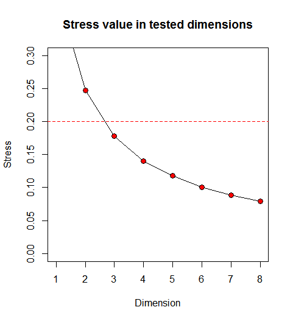

###### Fat by decade (left), three years as in manuscript (right).

#### -- Stressplots

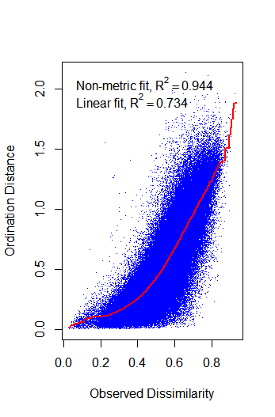 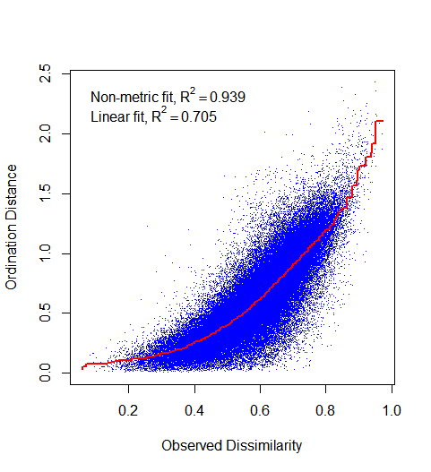 

###### Fat by decade (left), three years as in manuscript (right).

<br/> 


#### Protein

#### -- NMDS results

No convergent solutions found for decades data or 3yrs.

#### -- Stress Value Tests

 

###### Protein by decade (left), three years as in manuscript (right).

<br/>

#### -- Stressplots

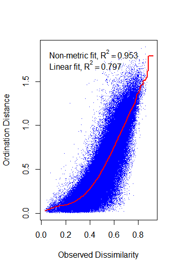 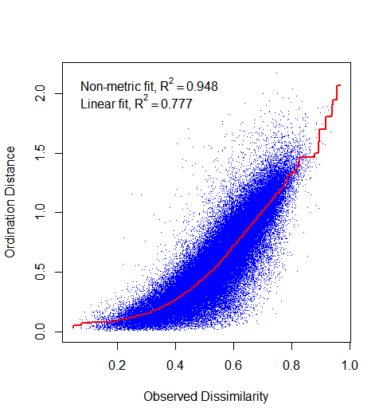 

###### Protein by decade (left), three years as in manuscript (right).

<br/> 

#### FoodWeight

#### -- NMDS results

No convergent solutions found for decades data or 3yrs.

#### -- Stress Value Tests

 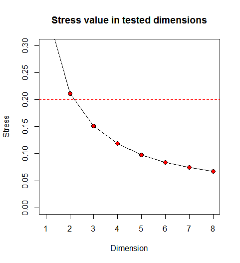

###### FoodWeight by decade (left), three years as in manuscript (right).

#### -- Stressplots

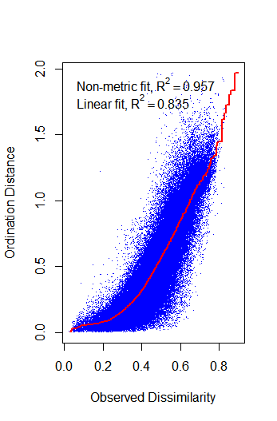 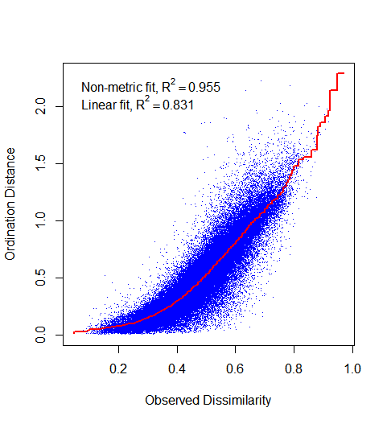 

###### FoodWeight by decade (left), three years as in manuscript (right).

<br/> 

#### Scaling in 2 and 3 dimensions

Stress plots suggest convergence will be met when running on 3 dimensions. I ran metaMDS() on 2 and 3 dimensions and plotted them using both coordinates for the results on 2 dimensions, and the firt two dimensions for 3 dimensions.

```{r eval=FALSE}
# 2 dimensions
MDSCalories<-metaMDS(dataNMDSDecadesCropsCalories,
                        distance="bray",
                        k=2, 
                        trymax = 20, 
                        stratmax=0.9999999999 )

# 3 dimensions
MDSCalories3Dim<-metaMDS(dataNMDSDecadesCropsCalories,
                       distance="bray",
                       k=3, 
                       trymax = 20, 
                       stratmax=0.9999999999 )
```

#### -- Calories Plots

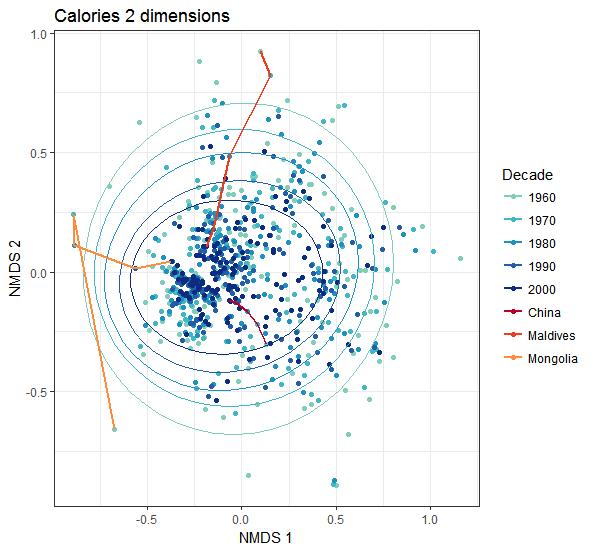 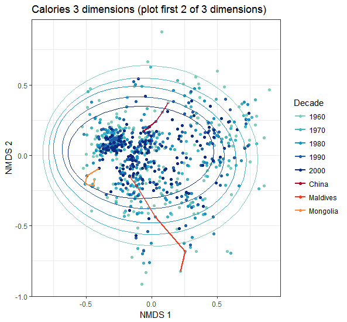 

#### -- Fat Plots

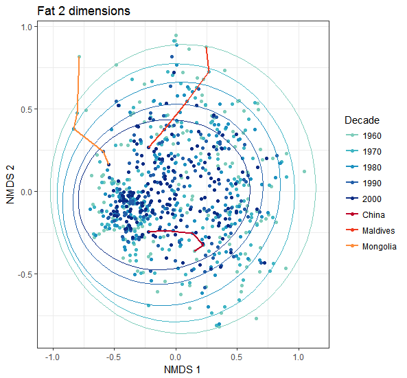 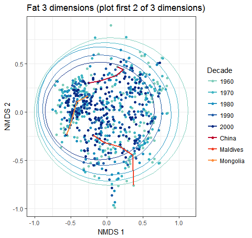 

#### -- Protein Plots

 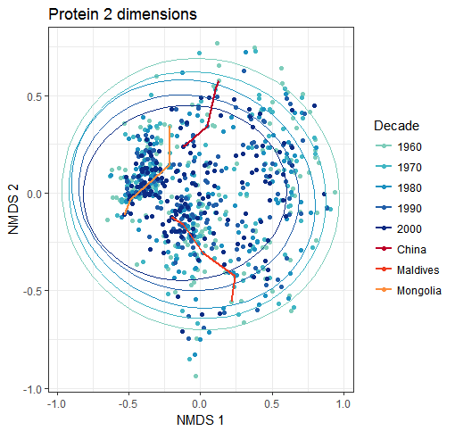 

#### -- FoodWeight Plots

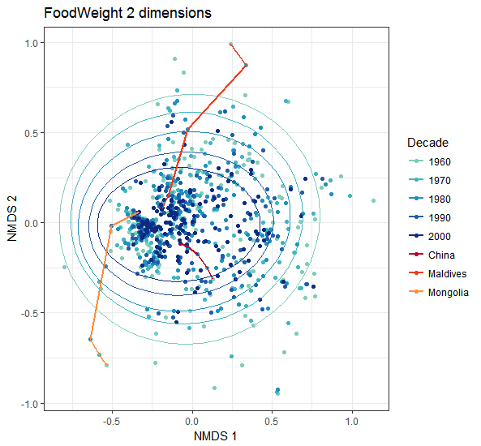 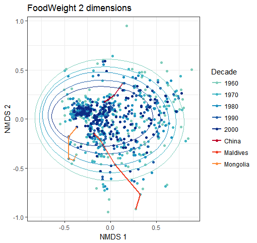 

